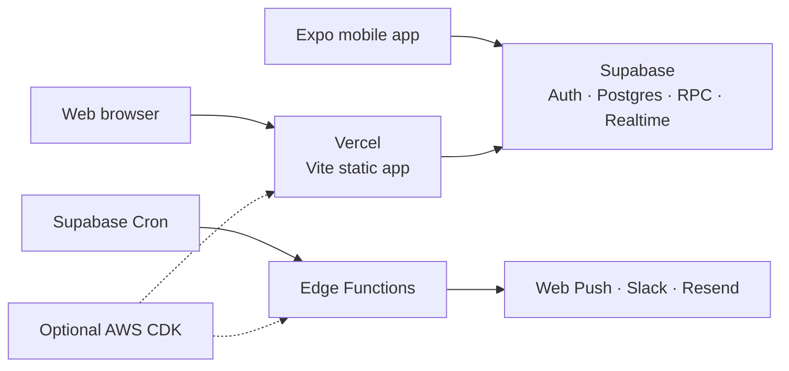

# 強制出席型スタディルーム

[English](README.md) | [한국어](README.ko.md) | [日本語](README.ja.md)

決めた時刻に学習を始める約束を、計画・集中・振り返り・改善・報酬へつなげる個人向け学習習慣プロダクトです。

[本番アプリを開く](https://study-room-attendance.vercel.app/) · [本番デプロイ workflow](https://github.com/zxcc9867/studyRoom/actions)


> READMEは現在のユーザー体験と運用モデルを要約しています。詳細な要件、設計判断、進捗は[メモリーバンク](memory-bank/)で管理します。

## このプロジェクトの目的

学習計画を立てることより、毎日実際に始めることのほうが難しい場合があります。このプロダクトは設定した出席時刻に適度な強制力を与え、欠席を罰として扱わずに学習セッション全体を支援します。

Vite/ReactのWebアプリ、Expoモバイル、Supabase Auth/Postgres/RPC/Realtime、予約通知、Three.jsの報酬空間を統合しています。

## 基本的な利用フロー

1. 保存済みSupabaseセッションを復元し、必要に応じてメールOTPまたはGoogle OAuthでログインします。
2. 日付別todo、時間計画、繰り返し予定、目標、D-dayを設定します。
3. Web Push、Slack、メールfallbackで設定時刻のリマインダーを受け取ります。
4. 当日の未完了todoを1件以上選択してセッションを開始します。
5. セッションは1時間のleaseで始まり、1時間単位で延長できます。現在時刻からの残り時間は最大2時間です。
6. 休憩時間を学習時間から除外し、10・20・40分後の復帰予定を設定できます。
7. Webでは上半身の在席をブラウザ内だけで判定します。写真、動画、顔特徴、姿勢ランドマークの原本は保存しません。
8. 終了時に集中度、エネルギー、妨げ、メモ、完了todo、次の行動を振り返ります。
9. 直近7日間の未振り返りセッションを後から整理し、最新の次の行動を次回計画へつなげます。
10. 10分の開始、日次目標、5/7の柔軟なリズム、非懲罰的な再開サインで習慣を育てます。
11. 週次比較と繰り返す妨げに対する具体的な環境調整案を確認します。
12. 出席と継続的な開始を、Study Forestの木、家具、屋外報酬、種の光、蛍のガーランドへ変換します。

## セッションleaseポリシー

- 開始時の基本leaseは1時間です。
- 1回の操作で1時間延長します。
- 現在時刻からの残り時間は最大2時間です。
- WebとSlackは同じサーバーRPCを使用します。
- 満了5分前にSlack警告を送信します。
- Webは15秒ごとにサーバーの締切時刻を同期します。
- ブラウザが閉じていてもSupabase Cronが満了セッションを終了します。
- lease満了後の時間は学習時間として保存されません。

## 主な機能

### 計画と学習セッション

- 日付別・繰り返しtodo、日付をまたぐ予定、月次完了履歴、目標連携。
- 重複時間を表示する円形デイリープランナー。
- サーバーで原子的に処理する開始・休憩・再開・延長・終了。
- 休憩時間の除外と任意の復帰予定。
- WebとExpoで同じセッション・todoルールを共有。

### 継続学習ループ

- セッション振り返りと直近の振り返りインボックス。
- 平日・週末の大きな目標の前に置く10分チェックポイント。
- 最新の次の行動を次回計画へ引き継ぐ仕組み。
- 休み・10分開始・目標・花を示す直近7日間のリズム。
- 2日の休息余白を持つ5/7目標。
- 週次比較、繰り返す妨げへの対策、適応型リマインダー候補。

### Study Forest

- 家、川、橋、庭、照明、時間帯表現を持つThree.js低ポリゴン島。
- キーボード、タッチ、クリック移動、自動散歩。
- 出席連続日数の木とマイルストーン報酬。
- 島テーマ、家のアクセント、代表報酬のユーザー設定。
- 完了セッションから再計算される種の光と蛍のガーランド。

### 出席・在席・回復

- 平日・週末目標と遅い時間の学習による出席回復。
- 5分警告と10分後の学習時間停止を行うブラウザ内在席判定。
- 欠席または繰り返し離席に対する回復リクエスト。
- 週次回復サマリーと原因分類。

### 通知と診断

- Web Push、Slack Bot、Resendメールfallback。
- すでに出席済みでも設定時刻の初回通知を1回送信し、その状態では再通知や欠席への降格を行いません。
- 重複を防ぐ通知claimと配信履歴。
- Slackテスト通知、lease警告、todo時刻通知、回復アクション。
- Supabase CronとEdge Functionによるサーバー側スケジュール。

## 最新ワークフローの補足

- Web の Today 画面は「集中・計画・記録」に分かれ、タイマー、今日の予定、最近の習慣と履歴を短い導線で確認できます。
- Web の学習開始モーダルでは、タイトルと開始・終了時刻を含む todo を追加でき、円形スケジュールと今回のセッション選択に即時反映されます。
- Expo のクイック追加は現時点でタイトル入力のみをサポートします。
- セッションは1時間の lease で開始し、1回につき1時間延長できますが、現在時刻からの残り時間は最大2時間です。
- モバイルのカメラ監視は、別 PRD の承認までは対象外です。
## アーキテクチャ

```text
apps/web          Vite + ReactダッシュボードとThree.js Study Forest
apps/mobile       Expo React Nativeクライアント
packages/core     出席、日付、OTP、通知、migrationテスト
supabase          Postgres migration、RLS、RPC、Cron、Edge Functions
infra/aws-cdk     任意のS3/CloudFront/EventBridge/Lambda構成
memory-bank       要件、設計判断、進捗、トラブルシューティング
```

- WebはVercel上の静的Viteアプリとして配信します。
- 両クライアントは同じSupabaseプロジェクトとRPC契約を利用します。
- Postgres RLSと明示的な実行権限でユーザーデータを分離します。
- Supabase Cronが毎分attendance Edge Functionを呼び出します。
- 日次・週次・月次の学習時間はタイムゾーン対応のサーバー集計を使用します。
- 習慣表示は読み込み済みセッションとtodoを再利用し、追加API負荷を発生させません。

### ランタイム構成と運用コスト



- 基本運用は小規模なVercel・Supabaseの無料枠に合わせられ、任意のAWS構成はデフォルト経路には不要です。
- 通知サービス、保存量、通信量、有効化したAWSリソースは利用量に応じて課金されます。コスト最小化の設計であり、完全無料を保証するものではありません。

[インフラ構成](docs/infrastructure-architecture.md)と[実装計画](memory-bank/implementation-plan.md)も参照してください。

## 主なデータ領域

- `profiles`: タイムゾーンと通知設定。
- `attendance_days`: 日次出席と通知claim。
- `study_todos`, `study_goals`: 計画と目標。
- `study_sessions`, `study_session_todos`: セッション、lease、選択todo。
- `study_session_reflections`: 振り返りと次の行動。
- `study_forest_preferences`: 報酬表示設定。
- `study_recovery_requests`, `study_recovery_weekly_reports`: 回復フロー。
- `notification_targets`, `notification_deliveries`: 通知設定と結果。
- `study_presence_events`: メディアを含まない在席イベント。

## 環境変数

実際のキーやトークンをコミットしないでください。ローカル設定は`.env.example`を参照します。

```text
# Web
VITE_SUPABASE_URL
VITE_SUPABASE_ANON_KEY
VITE_WEB_PUSH_VAPID_PUBLIC_KEY
VITE_GOOGLE_AUTH_ENABLED

# Expo
EXPO_PUBLIC_SUPABASE_URL
EXPO_PUBLIC_SUPABASE_ANON_KEY
EXPO_PUBLIC_EAS_PROJECT_ID

# Edge Functions / scheduler
SUPABASE_URL
SUPABASE_SERVICE_ROLE_KEY
CRON_SECRET
WEB_PUSH_VAPID_PUBLIC_KEY
WEB_PUSH_VAPID_PRIVATE_KEY
WEB_PUSH_SUBJECT
RESEND_API_KEY
RESEND_FROM_EMAIL
SLACK_BOT_TOKEN
SLACK_SIGNING_SECRET
APP_ORIGIN
```

## ローカル実行

```bash
npm.cmd install
npm.cmd run dev:web
```

Webは通常`http://127.0.0.1:5173`で起動します。必要に応じてViteが次の空きポートを選びます。

```bash
npm.cmd run dev:mobile
```

## 検証

```bash
npm.cmd test
npm.cmd run build
npm.cmd --workspace apps/mobile run typecheck
```

テストは出席ポリシー、認証復旧、session lease、休憩、10分チェックポイント、計画、通知、回復、継続学習、Study Forest、README契約、SQL migrationを対象にします。

## デプロイ

- `main`へのpushでGitHub ActionsがテストとWeb buildを実行し、Vercel productionへデプロイします。
- Supabase変更はmigrationとして適用し、RLS、関数権限、migration状態を確認します。
- 任意のAWS構成は次のコマンドでsynthできます。

```bash
npm.cmd run infra:synth
```

## セキュリティとプライバシー

- service role、Slack、Resend、VAPID秘密鍵をフロントエンドへ置きません。
- 公開スキーマのテーブルはRLSとユーザー所有権ポリシーを使用します。
- `SECURITY DEFINER` RPCは入力と所有権を検証し、広いpublic実行権限を削除します。
- カメラメディアと生体特徴は保存しません。
- ドキュメントに実際のユーザーID、チャンネルID、メール、トークンを記載しません。

## 詳細ドキュメント

READMEは概要です。継続学習ループ、認証復旧、session lease、休憩復帰予定、週次習慣リズム、Study Forest、通知、デプロイなどの機能要件と運用履歴は[`memory-bank/`](memory-bank/)で管理します。
