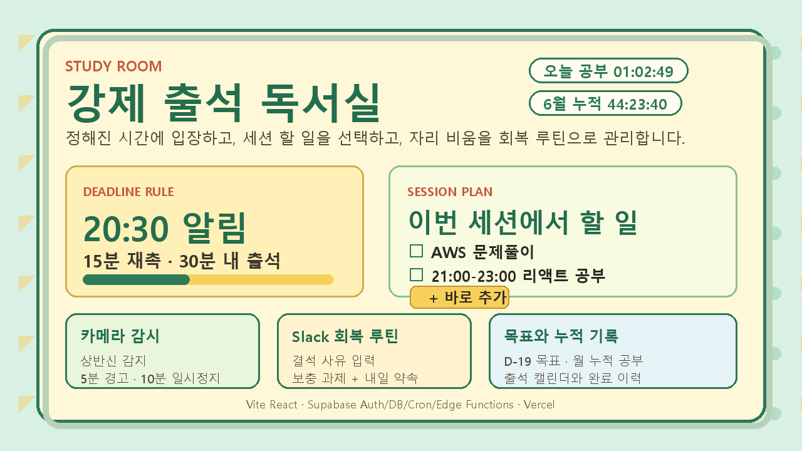

# 강제 출석형 독서실

매일 정해진 시간에 독서실에 입장하고 공부 타이머를 시작하도록 압박하는 개인용 MVP입니다. 알림 후 15분 안에 타이머를 시작해야 출석으로 인정되며, 캘린더와 todo list로 공부 습관과 해야 할 일을 함께 관리합니다.



## 주요 기능

- Supabase Auth 기반 이메일 OTP 로그인과 Google OAuth 로그인
- 매일 1개 알림 시간 설정
- 알림 후 15분 안에 타이머 시작 시 출석 인정
- 오늘 공부 시간과 선택 월 누적 공부 시간 표시
- 출석 캘린더와 월 선택
- 날짜별 todo list 작성, 체크, 달성률 표시
- 내 페이지에서 계정 정보와 완료한 todo 이력 확인
- Web Push 컴퓨터 알림, Telegram 알림, 이메일 보완 알림
- Supabase Cron + Edge Function 기반 서버 측 알림/결석 자동 처리
- 선택적 AWS CDK 인프라: S3/CloudFront 정적 호스팅과 EventBridge/Lambda 호출자

## 프로젝트 구조

```txt
apps/
  mobile/          Expo React Native 모바일 앱
  web/             Vite React 웹 대시보드
packages/
  core/            출석 판정, 날짜, OTP, 알림 보조 로직
supabase/
  migrations/      DB 테이블, RLS, RPC 마이그레이션
  functions/       attendance-cron, kakao-token, telegram-test-alarm
infra/
  aws-cdk/         선택적 AWS 배포 인프라
memory-bank/       제품/설계/진행 문서
```

## 시스템 구성

웹 앱은 정적 Vite 앱으로 빌드되어 Vercel, S3/CloudFront 같은 정적 호스팅에 올릴 수 있습니다. 사용자별 데이터, 인증, RLS, 알림 대상, 출석 기록은 Supabase가 관리합니다.

정해진 시간 알림은 브라우저가 꺼져 있어도 동작해야 하므로 클라이언트가 직접 예약하지 않습니다. Supabase Cron이 `attendance-cron` Edge Function을 주기적으로 호출하고, Edge Function이 알림 대상자를 조회해 Web Push, Telegram, 이메일 fallback을 발송합니다.

자세한 인프라 구성도와 알림/출석 처리 흐름은 [인프라 구성도](docs/infrastructure-architecture.md)를 참고합니다.

## 환경 변수

`.env.example`을 기준으로 로컬 `.env` 또는 배포 환경 변수를 설정합니다. 실제 키는 커밋하지 않습니다.

```txt
VITE_SUPABASE_URL
VITE_SUPABASE_ANON_KEY
VITE_WEB_PUSH_VAPID_PUBLIC_KEY
VITE_GOOGLE_AUTH_ENABLED

SUPABASE_URL
SUPABASE_SERVICE_ROLE_KEY
CRON_SECRET
WEB_PUSH_VAPID_PUBLIC_KEY
WEB_PUSH_VAPID_PRIVATE_KEY
WEB_PUSH_SUBJECT
RESEND_API_KEY
TELEGRAM_BOT_TOKEN
APP_ORIGIN
```

## 로컬 실행

```bash
npm.cmd install
npm.cmd run dev:web
```

웹 앱 기본 주소는 Vite 설정에 따라 `http://127.0.0.1:5177` 또는 사용 가능한 다음 포트가 됩니다.

모바일 앱은 Expo로 실행합니다.

```bash
npm.cmd run dev:mobile
```

## 검증

```bash
npm.cmd test
npm.cmd run build
```

현재 테스트는 출석 판정, OTP 처리, OAuth callback, Web Push 보조 로직, Telegram 알림, todo 이력 페이지네이션, 모바일 라이트 테마 회귀 방지를 포함합니다.

## 배포

### Vercel

1. Vercel 프로젝트에 `apps/web` Vite 빌드 환경 변수를 설정합니다.
2. `vercel.json` 기준으로 정적 웹 앱을 배포합니다.
3. Supabase Auth redirect URL에 배포 URL과 `/auth/callback`을 등록합니다.

### Supabase

1. `supabase/migrations` SQL을 적용합니다.
2. `attendance-cron` Edge Function을 배포합니다.
3. Edge Function secrets에 `CRON_SECRET`, VAPID 키, Resend 키, Telegram bot token 등을 설정합니다.
4. Supabase Vault에 `project_url`, `cron_secret`을 저장합니다.
5. `supabase/cron.sql`로 pg_cron 일정을 등록합니다.

### AWS 선택 구성

`infra/aws-cdk`는 정적 호스팅과 Supabase Edge Function 호출자를 AWS로 운영하고 싶을 때 사용합니다. MVP에서는 Supabase Cron만으로도 알림 자동 처리가 가능합니다.

```bash
npm.cmd run infra:synth
```

## 보안 메모

- Supabase service role key, Telegram bot token, Resend key, VAPID private key는 프론트엔드에 넣지 않습니다.
- 사용자 데이터는 Supabase RLS를 기준으로 본인 데이터만 접근하도록 제한합니다.
- Telegram Chat ID는 사용자별 `notification_targets`에 저장하고, bot token은 Edge Function secret으로만 관리합니다.
- README나 memory-bank에 실제 토큰, Chat ID, 개인 이메일을 기록하지 않습니다.
