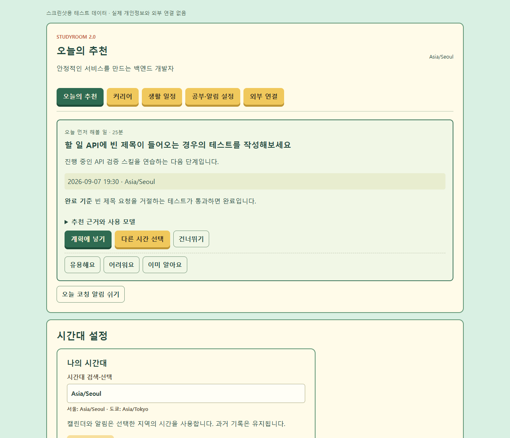
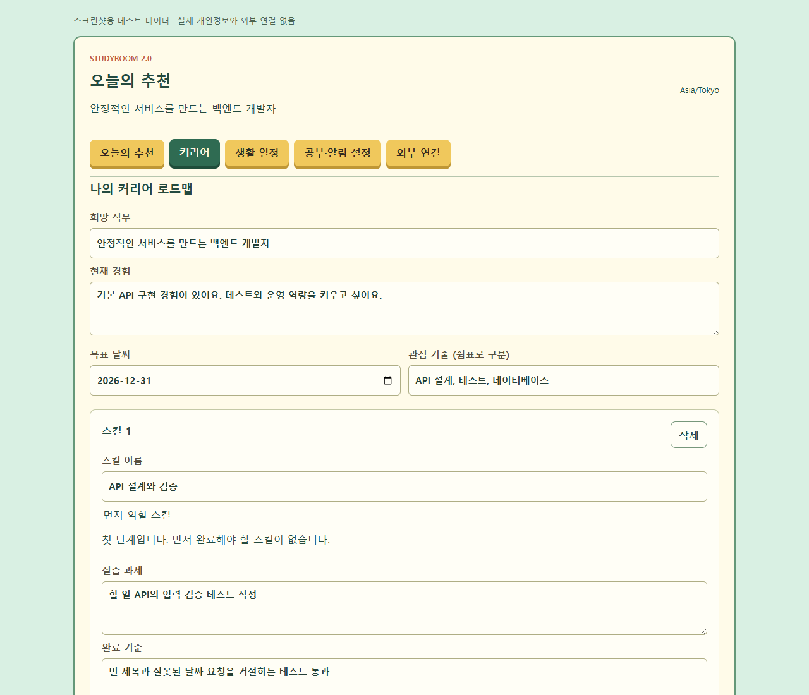
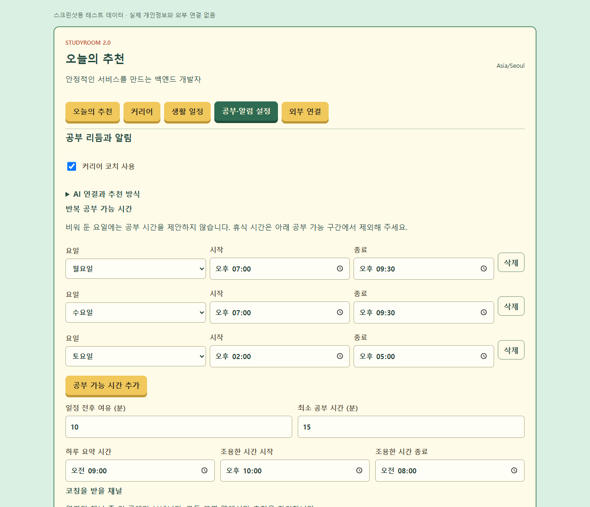
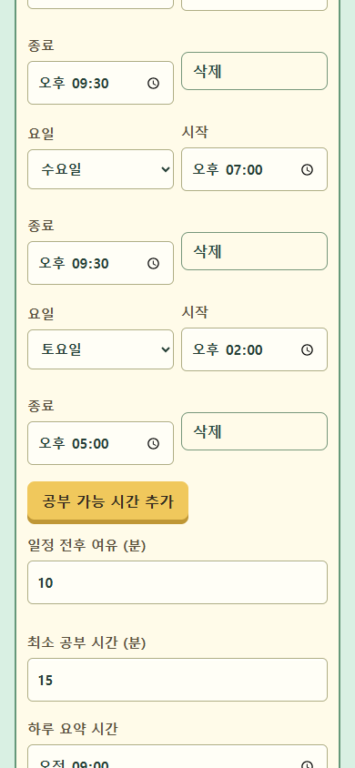
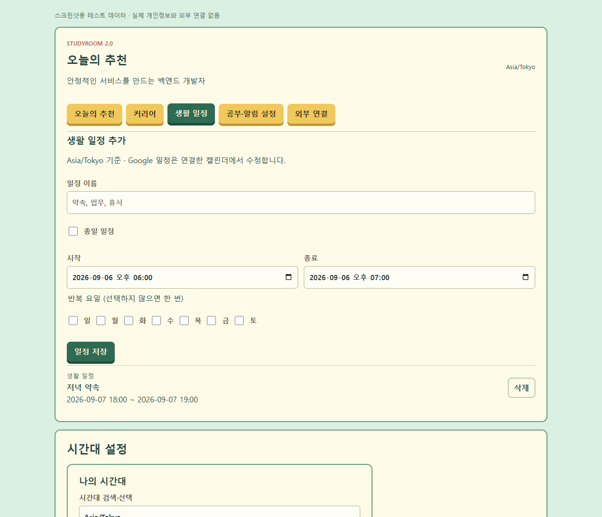
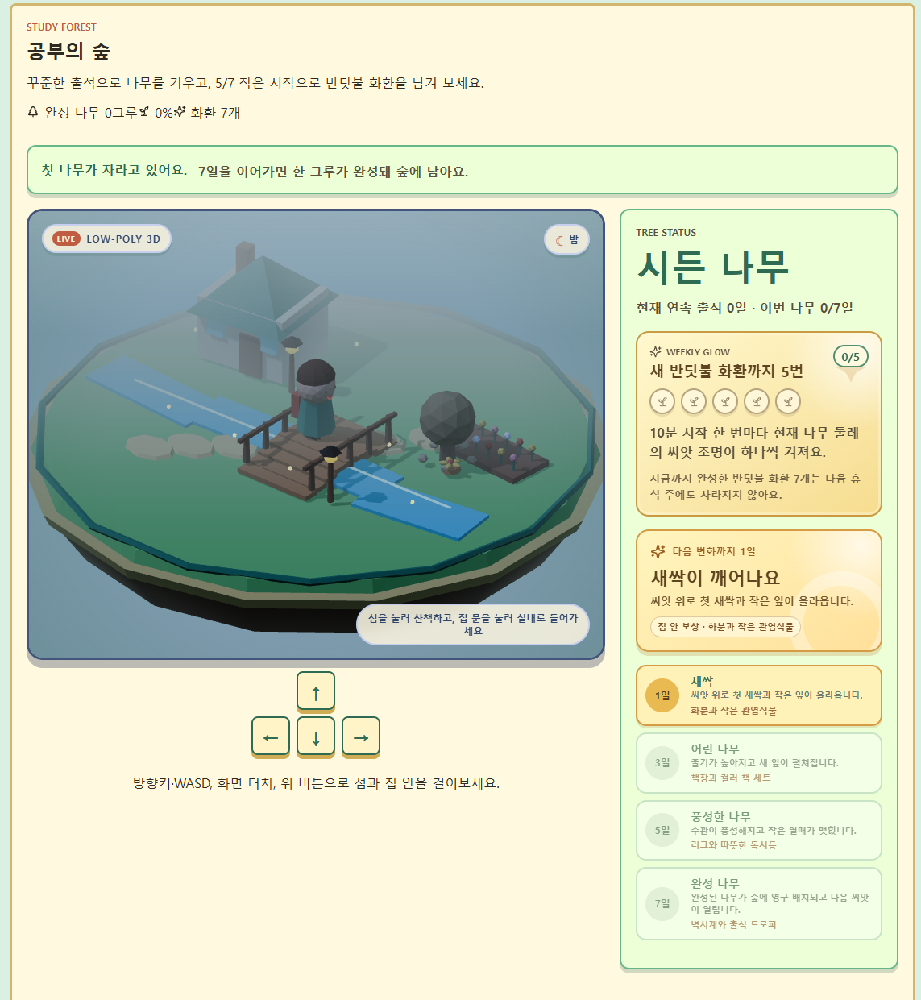
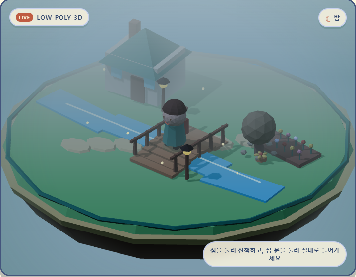
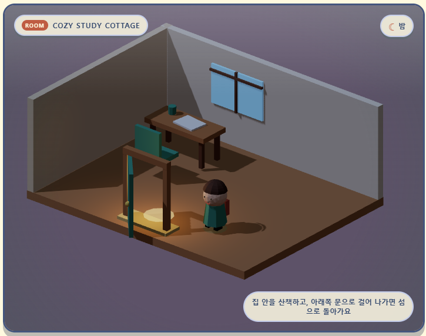
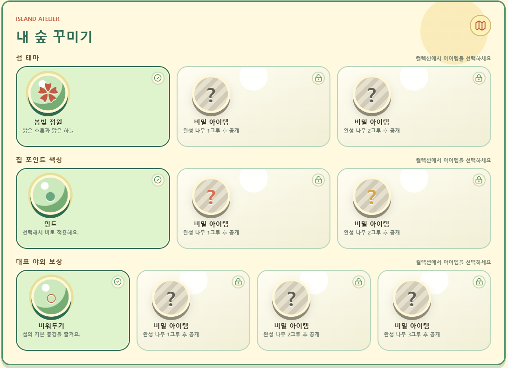

# Forced-Attendance Study Room

[English](README.md) | [한국어](README.ko.md) | [日本語](README.ja.md)

## StudyRoom 2.0 — your interests, a technology feed

Enter a public technology interest on the website, then receive, edit or pause your feed. No personal search API key or SNS connection is required. Discover → read a Korean summary or source/search introduction → open the original → plan a study todo. Latest/saved views, filters and manual 20-item pages keep reading predictable; source subscriptions live in advanced settings. Today remains the entry page. Preferences, saves and todo links are owner-scoped on the server.

A separate worker combines approved RSS/Atom/Hacker News sources with public-web search. Normalization-equivalent interest queries share an hourly cache. Search is free-only, uses an app-wide maximum of 900 attempts/month, checks the provider's free account limits before calling, and never switches to paid services. When search quota runs out, eligible RSS/API collection continues. AI uses actual excerpts/snippets only and shares the existing six actual calls per user/day budget, including failures. Insufficient evidence remains an introduction and original link.

Search covers publicly indexed results, not every page or private SNS content. Search introductions are labelled separately from AI summaries. Eight recommended RSS/API sources start **pending permission review**; custom public HTTPS feeds are previewed and limited to ten per user. A search result does not approve the publisher's RSS reuse rights.

**User setup and operational activation are separate.** The app operator must provision a dedicated free search key, disable pay-as-you-go, configure the worker and verify live collection. No key or exhausted quota means no live web search, not fabricated news. [Current delivery status](memory-bank/progress.md) · [Search operation guide](docs/tech-feed/search-provider.md) · [Requirements](memory-bank/prd-tech-feed.md) · [Career code restoration](archive/career-coach/README.md). Career-only UI/automation is archived; independent time-zone settings and restart coaching remain.

A personal study-habit product that turns a scheduled commitment into a repeatable loop: plan, focus, reflect, adjust, and earn visible rewards.

[Open the production app](https://study-room-attendance.vercel.app/) · [Production deployment workflow](https://github.com/zxcc9867/studyRoom/actions)


> The README summarizes the current user experience and operating model. Detailed requirements, decisions, and delivery history live in the [memory bank](memory-bank/).

## Archived: career study coach

The following description and screenshots document the previous implementation, not active features in this version. Its dedicated code/tests are preserved under `archive/career-coach/`; existing database history is retained.

The 2.0 pilot connects one active career to an editable skill roadmap, available calendar time, and automatic daily recommendations. Suggestions become real todos only when accepted. Google Calendar and selected public/private GitHub repositories require their own connections; registering an OAuth app alone does not connect an account.

- Choose a time zone, including Seoul and Tokyo. Your saved choice is preserved across devices and alarm-setting edits.
- Define study windows and rest, add life events, and read selected Google calendars. Calendar titles are not sent to the model.
- Review an automatic next action, its skill, duration and completion criteria; accept, reschedule or skip it.
- Connect Slack, Web Push or email explicitly. Only enabled channels receive coaching; no connected channels means in-app recommendations only, with no email fallback.
- Inspect repository improvement ideas with file/commit evidence. Private-code AI analysis is opt-in per repository. The coach never executes code or creates commits/PRs.

External OAuth configuration, device notification permission and actual delivery must be verified separately. [Connection and operation guide](docs/studyroom-v2-setup.md) · [Requirements and rollout](memory-bank/prd-studyroom-v2.md).

### AI service and model policy

| Setting | Behavior |
| --- | --- |
| Service | OpenRouter, server-side only |
| Configured model | `OPENROUTER_MODEL`; default `openrouter/free`, or an explicitly selected `:free` model |
| Actual model | Read from each successful provider response; a router is not a fixed model |
| Cost policy | Free models only, zero-price provider limits, no paid fallback |
| Default limits | 1,024 output tokens, 20-second timeout; optional environment overrides |
| Shared pilot budget | At most 6 actual model calls per user/day, including failed requests; cached results do not call AI |
| Failure behavior | Deterministic recommendations from the confirmed roadmap; no claim that the fallback was AI-generated |

Routing does not guarantee the same model or the highest quality on every call. No credentials, private prompts or private repository source are included in this README.

### Screenshots of the 2.0 interface

Captured from the implemented React interface with synthetic test data. These images demonstrate the UI, not a live Google/GitHub connection or actual notification delivery.











## Why this project exists

Starting to study consistently is often harder than planning to study. This product adds gentle pressure around a chosen attendance time, then supports the entire session lifecycle without turning missed days into a punitive streak reset.

The system combines a Vite/React web app, an Expo mobile client, Supabase Auth/Postgres/RPC/Realtime, scheduled notifications, and a Three.js reward space.

## Core experience

1. Restore an existing Supabase session, or sign in with email OTP and optional Google OAuth.
2. Plan dated todos, timed schedules, recurring work, goals, and D-days.
3. Receive a scheduled reminder through Web Push, Slack, or email fallback.
4. Use the Today workspace through Focus, Plan, and Records tabs. Start a session only after selecting at least one unfinished todo for today. On the web, a quick-added todo can include a title and start/end time, appears immediately in the circular schedule, and is selected for the session; Expo quick add currently captures the title only.
5. Begin with a one-hour session lease and extend it in one-hour increments, with at most two hours remaining from the current time.
6. Pause and resume without counting break time as study time; optionally set a 10, 20, or 40-minute return promise.
7. Use browser-only upper-body presence detection on the web. No photo, video, face feature, or raw pose landmark is stored.
8. Review focus, energy, friction, notes, completed todos, and the next action when ending a session.
9. Recover missed reflections from a seven-day inbox and carry the latest next action into the following plan.
10. Build the habit through a ten-minute start, daily study goals, a flexible five-of-seven rhythm, and non-punitive restart cues.
11. Review current or past weeks/months in My Page, compare study time and habits, and receive one concrete environment adjustment when the same friction repeats.
12. Turn attendance and consistent starts into trees, furniture, outdoor objects, seed lights, and persistent firefly garlands in the Study Forest.

## Session lease policy

- Initial lease: one hour when a session starts.
- Extension: one hour per request.
- Remaining-time cap: no more than two hours from the current time.
- Web and Slack extensions use the same server-side RPC.
- A Slack warning is sent five minutes before expiry.
- The web app synchronizes the server deadline every 15 seconds.
- Supabase Cron closes expired sessions even when the browser is closed.
- Time after the lease expires is never stored as study time.

## Main capabilities

### Planning and study sessions

- Today is separated into Focus, Plan, and Records so the active timer, schedule, and history remain easy to scan.
- Dated and recurring todos, cross-midnight schedules, monthly completion history, and goal-linked tasks.
- The web start modal can quick-add a timed todo and place it directly into the current session and circular schedule.
- Circular daily planner with overlap detection.
- Atomic server-side start, pause, resume, extend, and end flows.
- Break time exclusion and optional return promises.
- Web and Expo clients share the same session and todo rules; mobile camera monitoring remains out of scope until a separate PRD is approved.

### Sustainable learning loop

- End-of-session reflections and a recent reflection inbox.
- Ten-minute checkpoint before the larger weekday and weekend targets.
- Latest next action carried into the next session plan.
- Seven-day rhythm with rest, ten-minute starts, goals, and flower rewards.
- Flexible five-of-seven target with two rest-day margins.
- Weekly/monthly reports with past-period navigation, explicit comparison dates and monthly daily averages.
- Completed-session totals use the saved account time zone; loading/errors never masquerade as zero, and failed reports can be retried.
- Repeated-friction guidance, next-action planning and adaptive reminder suggestions.
- Reports are recalculated from saved records, not scheduled notifications or immutable snapshots. See [report requirements](memory-bank/prd-study-reports.md).

### Study Forest

- A low-poly Three.js island with a house, river, bridge, garden, lighting, and time-of-day environment.
- Keyboard, touch, click-to-move, and auto-walk controls.
- Attendance streak trees and milestone furniture or outdoor rewards.
- User-selectable island theme, house accent, and representative reward.
- Persistent five-of-seven seed lights and firefly garlands derived from completed sessions.

#### A habit space you can walk through

<p align="center">
  
</p>

A study streak is not a static badge here. The avatar walks across the island, crosses a collision-aware bridge, enters the cottage, and sees the environment change as attendance and small starts accumulate.

| Explore a live island | Step into the study cottage |
| --- | --- |
|  |  |
| **Move with intent.** Keyboard, touch, click, and auto-walk all use the same walkable routes across land and bridge. | **Keep the reward personal.** The cottage has a real doorway, an interior study space, furniture, and a walk-out exit. |

**Progress has a place in the world.** Five small starts light seed lamps around the current tree, seven consecutive attendance days finish a tree, and completed trees unlock new interior and outdoor rewards.

<p align="center">
  
</p>

### Attendance, presence, and recovery

- Weekday and weekend attendance goals with late-study recovery.
- Browser-only presence classification with a five-minute warning and a ten-minute study-time pause.
- Recovery requests for missed attendance or repeated absence.
- Accumulated missed days share one recovery routine across devices; the covered dates and day count remain visible, and makeup tasks are scheduled for the user's current local date.
- Weekly recovery summaries and reason categories.

### Notifications and diagnostics

- Web Push, Slack Bot, and Resend email fallback.
- One scheduled initial reminder even when attendance is already complete; no nudge or absence downgrade in that state.
- Idempotent reminder claims and delivery history.
- Slack test notifications, lease warnings, todo timing alerts, and recovery actions.
- Server-side scheduling through Supabase Cron and Edge Functions.

## Architecture

```text
apps/web          Vite + React dashboard and Three.js Study Forest
apps/mobile       Expo React Native client
packages/core     Attendance, date, OTP, notification, and migration tests
supabase          Postgres migrations, RLS, RPCs, Cron, and Edge Functions
infra/aws-cdk     Optional S3/CloudFront/EventBridge/Lambda infrastructure
memory-bank       Product requirements, decisions, progress, and troubleshooting
```

- The web app is deployed as a static Vite application on Vercel.
- Both clients use the same Supabase project and RPC contracts.
- Postgres RLS and explicit execution grants isolate user data.
- Supabase Cron invokes the attendance Edge Function every minute.
- Daily, weekly, and monthly study time use timezone-aware server summaries.
- Client-only habit indicators reuse already loaded session and todo data instead of adding API traffic.

See [infrastructure architecture](docs/infrastructure-architecture.md) and the [implementation plan](memory-bank/implementation-plan.md).

## Important data domains

- `profiles`: timezone and reminder preferences.
- `attendance_days`: daily attendance and reminder claims.
- `study_todos`, `study_goals`: plans and goals.
- `study_sessions`, `study_session_todos`: sessions, leases, and selected tasks.
- `study_session_reflections`: reflection data and next actions.
- `study_forest_preferences`: visual reward preferences.
- `study_recovery_requests`, `study_recovery_weekly_reports`: recovery flows.
- `notification_targets`, `notification_deliveries`: notification configuration and results.
- `study_presence_events`: non-media presence metadata.

## Environment variables

Never commit real keys or tokens. Use `.env.example` for local configuration.

```text
# Web
VITE_SUPABASE_URL
VITE_SUPABASE_ANON_KEY
VITE_WEB_PUSH_VAPID_PUBLIC_KEY
VITE_GOOGLE_AUTH_ENABLED

# Expo
EXPO_PUBLIC_SUPABASE_URL
EXPO_PUBLIC_SUPABASE_ANON_KEY
EXPO_PUBLIC_EAS_PROJECT_ID

# Edge Functions and scheduler
SUPABASE_URL
SUPABASE_SERVICE_ROLE_KEY
CRON_SECRET
WEB_PUSH_VAPID_PUBLIC_KEY
WEB_PUSH_VAPID_PRIVATE_KEY
WEB_PUSH_SUBJECT
RESEND_API_KEY
RESEND_FROM_EMAIL
SLACK_BOT_TOKEN
SLACK_SIGNING_SECRET
APP_ORIGIN
```

## Run locally

```bash
npm.cmd install
npm.cmd run dev:web
```

The web app normally starts at `http://127.0.0.1:5173`. Vite selects the next available port if necessary.

```bash
npm.cmd run dev:mobile
```

## Verification

```bash
npm.cmd test
npm.cmd run build
npm.cmd run mobile:check
```

The test suite covers attendance policy, authentication recovery, session leases, breaks, the ten-minute checkpoint, planning, notifications, recovery, sustainable-learning rules, Study Forest behavior, README contracts, and SQL migrations.

## Deployment

- A push to `main` runs tests and the web build through GitHub Actions before deploying to Vercel production.
- Supabase changes are applied as migrations and verified against RLS, function grants, and migration state.
- `infra/aws-cdk` is optional and can be synthesized with:

```bash
npm.cmd run infra:synth
```

## Security and privacy

- Service-role keys, Slack secrets, Resend keys, and VAPID private keys never belong in frontend code.
- Public-schema tables use RLS and user-ownership policies.
- `SECURITY DEFINER` RPCs validate input and ownership and remove broad public execution grants.
- Camera media and biometric features are not stored.
- Documentation must not contain real user IDs, channel IDs, email addresses, or tokens.

## Detailed documentation

The README is an overview. Feature-level requirements and operational history are maintained under [`memory-bank/`](memory-bank/), including the sustainable study loop, authentication recovery, session lease expiry, break return plan, weekly habit rhythm, Study Forest, notifications, and deployment.

## AI integration foundation

Server-only OpenRouter client and optional GitHub-to-Vercel environment sync are prepared for future AI features. No generation endpoint or automatic model calls are enabled. See [setup and server usage](docs/openrouter-setup.md).
