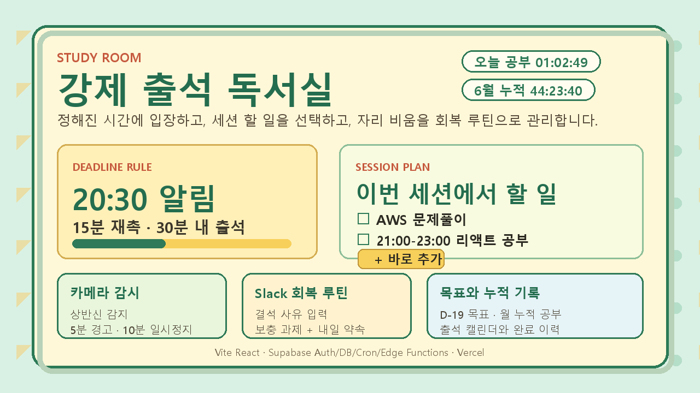

# Forced-Attendance Study Room

[English](README.md) | [한국어](README.ko.md) | [日本語](README.ja.md)

A personal study-habit product that turns a scheduled commitment into a repeatable loop: plan, focus, reflect, adjust, and earn visible rewards.

[Open the production app](https://study-room-attendance.vercel.app/) · [Production deployment workflow](https://github.com/zxcc9867/studyRoom/actions)



> The README summarizes the current user experience and operating model. Detailed requirements, decisions, and delivery history live in the [memory bank](memory-bank/).

## Why this project exists

Starting to study consistently is often harder than planning to study. This product adds gentle pressure around a chosen attendance time, then supports the entire session lifecycle without turning missed days into a punitive streak reset.

The system combines a Vite/React web app, an Expo mobile client, Supabase Auth/Postgres/RPC/Realtime, scheduled notifications, and a Three.js reward space.

## Core experience

1. Restore an existing Supabase session, or sign in with email OTP and optional Google OAuth.
2. Plan dated todos, timed schedules, recurring work, goals, and D-days.
3. Receive a scheduled reminder through Web Push, Slack, or email fallback.
4. Start a session only after selecting at least one unfinished todo for today.
5. Begin with a one-hour session lease and extend it in one-hour increments, with at most two hours remaining from the current time.
6. Pause and resume without counting break time as study time; optionally set a 10, 20, or 40-minute return promise.
7. Use browser-only upper-body presence detection on the web. No photo, video, face feature, or raw pose landmark is stored.
8. Review focus, energy, friction, notes, completed todos, and the next action when ending a session.
9. Recover missed reflections from a seven-day inbox and carry the latest next action into the following plan.
10. Build the habit through a ten-minute start, daily study goals, a flexible five-of-seven rhythm, and non-punitive restart cues.
11. Compare weekly performance and receive one concrete environment adjustment when the same friction repeats.
12. Turn attendance and consistent starts into trees, furniture, outdoor objects, seed lights, and persistent firefly garlands in the Study Forest.

## Session lease policy

- Initial lease: one hour when a session starts.
- Extension: one hour per request.
- Remaining-time cap: no more than two hours from the current time.
- Web and Slack extensions use the same server-side RPC.
- A Slack warning is sent five minutes before expiry.
- The web app synchronizes the server deadline every 15 seconds.
- Supabase Cron closes expired sessions even when the browser is closed.
- Time after the lease expires is never stored as study time.

## Main capabilities

### Planning and study sessions

- Dated and recurring todos, cross-midnight schedules, monthly completion history, and goal-linked tasks.
- Circular daily planner with overlap detection.
- Atomic server-side start, pause, resume, extend, and end flows.
- Break time exclusion and optional return promises.
- Web and Expo clients share the same session and todo rules.

### Sustainable learning loop

- End-of-session reflections and a recent reflection inbox.
- Ten-minute checkpoint before the larger weekday and weekend targets.
- Latest next action carried into the next session plan.
- Seven-day rhythm with rest, ten-minute starts, goals, and flower rewards.
- Flexible five-of-seven target with two rest-day margins.
- Weekly comparison, repeated-friction guidance, and adaptive reminder suggestions.

### Study Forest

- A low-poly Three.js island with a house, river, bridge, garden, lighting, and time-of-day environment.
- Keyboard, touch, click-to-move, and auto-walk controls.
- Attendance streak trees and milestone furniture or outdoor rewards.
- User-selectable island theme, house accent, and representative reward.
- Persistent five-of-seven seed lights and firefly garlands derived from completed sessions.

### Attendance, presence, and recovery

- Weekday and weekend attendance goals with late-study recovery.
- Browser-only presence classification with a five-minute warning and a ten-minute study-time pause.
- Recovery requests for missed attendance or repeated absence.
- Weekly recovery summaries and reason categories.

### Notifications and diagnostics

- Web Push, Slack Bot, and Resend email fallback.
- One scheduled initial reminder even when attendance is already complete; no nudge or absence downgrade in that state.
- Idempotent reminder claims and delivery history.
- Slack test notifications, lease warnings, todo timing alerts, and recovery actions.
- Server-side scheduling through Supabase Cron and Edge Functions.

## Architecture

```text
apps/web          Vite + React dashboard and Three.js Study Forest
apps/mobile       Expo React Native client
packages/core     Attendance, date, OTP, notification, and migration tests
supabase          Postgres migrations, RLS, RPCs, Cron, and Edge Functions
infra/aws-cdk     Optional S3/CloudFront/EventBridge/Lambda infrastructure
memory-bank       Product requirements, decisions, progress, and troubleshooting
```

- The web app is deployed as a static Vite application on Vercel.
- Both clients use the same Supabase project and RPC contracts.
- Postgres RLS and explicit execution grants isolate user data.
- Supabase Cron invokes the attendance Edge Function every minute.
- Daily, weekly, and monthly study time use timezone-aware server summaries.
- Client-only habit indicators reuse already loaded session and todo data instead of adding API traffic.

See [infrastructure architecture](docs/infrastructure-architecture.md) and the [implementation plan](memory-bank/implementation-plan.md).

## Important data domains

- `profiles`: timezone and reminder preferences.
- `attendance_days`: daily attendance and reminder claims.
- `study_todos`, `study_goals`: plans and goals.
- `study_sessions`, `study_session_todos`: sessions, leases, and selected tasks.
- `study_session_reflections`: reflection data and next actions.
- `study_forest_preferences`: visual reward preferences.
- `study_recovery_requests`, `study_recovery_weekly_reports`: recovery flows.
- `notification_targets`, `notification_deliveries`: notification configuration and results.
- `study_presence_events`: non-media presence metadata.

## Environment variables

Never commit real keys or tokens. Use `.env.example` for local configuration.

```text
# Web
VITE_SUPABASE_URL
VITE_SUPABASE_ANON_KEY
VITE_WEB_PUSH_VAPID_PUBLIC_KEY
VITE_GOOGLE_AUTH_ENABLED

# Expo
EXPO_PUBLIC_SUPABASE_URL
EXPO_PUBLIC_SUPABASE_ANON_KEY
EXPO_PUBLIC_EAS_PROJECT_ID

# Edge Functions and scheduler
SUPABASE_URL
SUPABASE_SERVICE_ROLE_KEY
CRON_SECRET
WEB_PUSH_VAPID_PUBLIC_KEY
WEB_PUSH_VAPID_PRIVATE_KEY
WEB_PUSH_SUBJECT
RESEND_API_KEY
RESEND_FROM_EMAIL
SLACK_BOT_TOKEN
SLACK_SIGNING_SECRET
APP_ORIGIN
```

## Run locally

```bash
npm.cmd install
npm.cmd run dev:web
```

The web app normally starts at `http://127.0.0.1:5173`. Vite selects the next available port if necessary.

```bash
npm.cmd run dev:mobile
```

## Verification

```bash
npm.cmd test
npm.cmd run build
npm.cmd --workspace apps/mobile run typecheck
```

The test suite covers attendance policy, authentication recovery, session leases, breaks, the ten-minute checkpoint, planning, notifications, recovery, sustainable-learning rules, Study Forest behavior, README contracts, and SQL migrations.

## Deployment

- A push to `main` runs tests and the web build through GitHub Actions before deploying to Vercel production.
- Supabase changes are applied as migrations and verified against RLS, function grants, and migration state.
- `infra/aws-cdk` is optional and can be synthesized with:

```bash
npm.cmd run infra:synth
```

## Security and privacy

- Service-role keys, Slack secrets, Resend keys, and VAPID private keys never belong in frontend code.
- Public-schema tables use RLS and user-ownership policies.
- `SECURITY DEFINER` RPCs validate input and ownership and remove broad public execution grants.
- Camera media and biometric features are not stored.
- Documentation must not contain real user IDs, channel IDs, email addresses, or tokens.

## Detailed documentation

The README is an overview. Feature-level requirements and operational history are maintained under [`memory-bank/`](memory-bank/), including the sustainable study loop, authentication recovery, session lease expiry, break return plan, weekly habit rhythm, Study Forest, notifications, and deployment.
