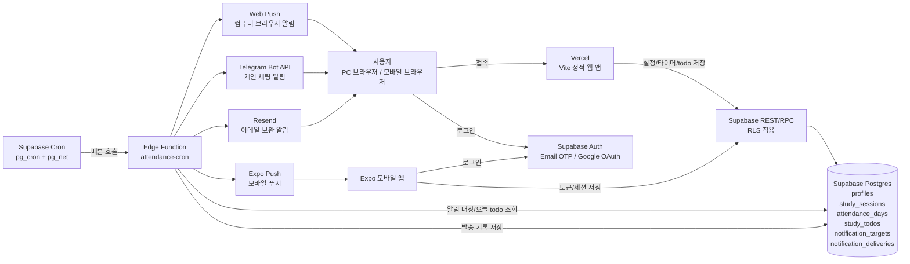
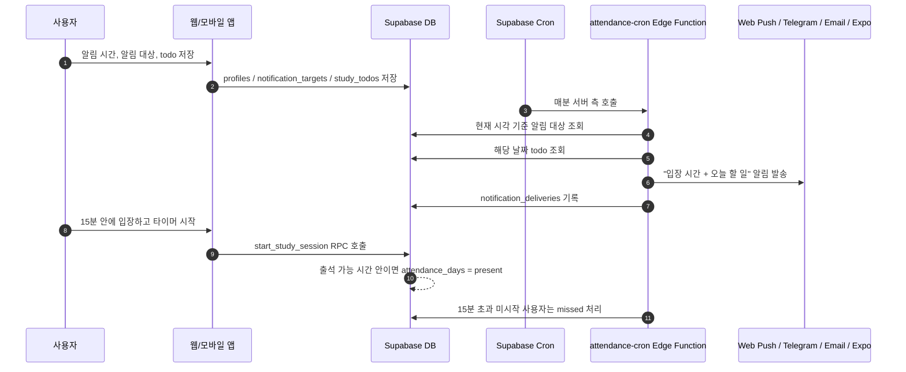
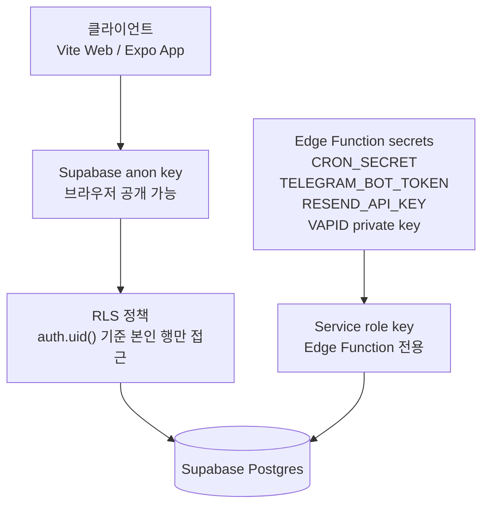
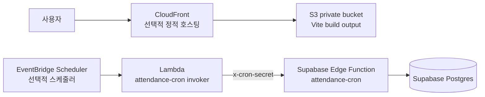

# 인프라 구성도

이 문서는 강제 출석형 독서실 앱의 현재 권장 인프라와 선택적 AWS 확장 구성을 정리한다.

## 현재 권장 구성

현재 MVP의 기본 운영 구조는 `Vercel 정적 웹 호스팅 + Supabase Auth/DB/Cron/Edge Function`이다. 웹 앱은 정적 파일로 배포되지만, 알림 발송과 출석/결석 자동 처리는 Supabase 서버 측 실행 환경에서 처리한다.

## 알림과 출석 처리 흐름

## 데이터 경계

- 프론트엔드에는 `VITE_SUPABASE_URL`, `VITE_SUPABASE_ANON_KEY`, `VITE_WEB_PUSH_VAPID_PUBLIC_KEY`처럼 공개 가능한 값만 들어간다.
- `SUPABASE_SERVICE_ROLE_KEY`, `TELEGRAM_BOT_TOKEN`, `RESEND_API_KEY`, `WEB_PUSH_VAPID_PRIVATE_KEY`, `CRON_SECRET`은 Edge Function secret 또는 서버 측 환경에만 둔다.
- 사용자 데이터 접근은 Supabase RLS가 `auth.uid()` 기준으로 제한한다.

## 선택적 AWS 구성

AWS CDK 코드는 선택적 구성이다. 비용을 최소화하려면 기본적으로 Supabase Cron을 사용하고, AWS 운영을 원할 때만 EventBridge/Lambda 또는 S3/CloudFront를 사용한다.

AWS 선택 구성의 역할은 두 가지뿐이다.

- 정적 웹 파일을 S3/CloudFront로 제공한다.
- EventBridge/Lambda가 Supabase `attendance-cron` Edge Function을 호출한다.

데이터베이스, 인증, RLS, 알림 대상 관리, 실제 알림 발송 판단은 계속 Supabase가 담당한다.

## 운영 메모

- 컴퓨터가 꺼져 있으면 브라우저 Web Push는 받을 수 없다. 이 경우 Telegram, 이메일, 모바일 Expo Push 같은 외부 채널이 보완 역할을 한다.
- Vercel/S3 같은 정적 호스팅은 화면 제공만 담당한다. 정해진 시간 알림은 Supabase Cron 또는 AWS EventBridge 같은 서버 측 스케줄러가 담당해야 한다.
- Telegram 알림에는 해당 날짜 todo가 있으면 같이 포함된다.
- `attendance-cron`은 알림 발송뿐 아니라 15분 미입장 사용자의 결석 처리도 수행한다.
