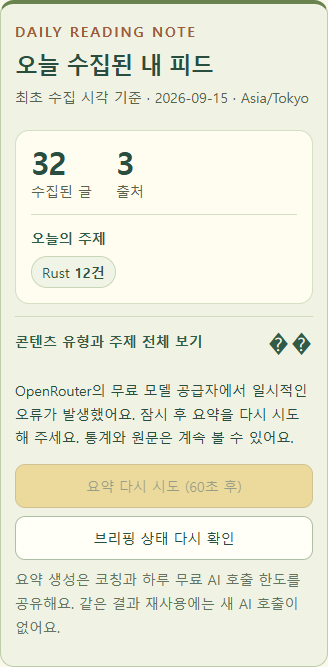

# 기술 피드 AI 요약 오류 복구

사용 흐름: 오늘 브리핑 → 요약 요청 → 오류별 안내 → 대기 후 요약 다시 시도. 조회와 상태 재확인은 AI를 생성하지 않는다. 통계·원문은 요약 공급자 장애와 별개로 읽을 수 있다.

## 오류와 재시도

- OpenRouter 502/503/504: 공급자 일시 실패. 첫 실패가 빠르고 남은 기한이 충분한 경우에만 500ms 뒤 한 번 자동 재시도한다. 두 번째 실패는 사용자 재시도로 넘긴다.
- 429: 호출 제한. 자동 재시도하지 않고 기본 120초 대기한다.
- 시간 초과·연결 실패·검증되지 않은 결과: 원인을 구분하고 기본 60초 후 명시적 재시도를 허용한다.
- 설정 오류: 현재 키·모델 설정이 없거나 형식이 잘못되면 생성 차단을 유지한다. 이전 공급자 인증 오류는 설정이 유효하고 대기 시간이 지난 뒤 상태를 다시 확인하면 수동 재시도를 허용한다. 읽기 조회·인증 오류는 자동 AI 호출을 하지 않는다. 공급자 원문 오류·키는 화면이나 로그에 넣지 않는다.
- 유효한 Retry-After가 있으면 자동 재시도를 피하고 해당 대기 안내를 적용한다.

전체 요청 30초, 시도당 20초를 유지한다. 늦은 응답·계정/날짜/시간대 변경·권한 철회 결과는 저장/표시에 재검증이 필요하다.
## 무료 모델·예산

OpenRouter 공용 서버 모듈을 재사용한다. OPENROUTER_MODEL은 기본 openrouter/free 또는 명시한 :free 모델이며 무료 가격 제한을 유지한다. 유료 fallback과 모델 정책 변경은 없다. 라우터는 고정 모델이 아니며 실제 응답 모델은 결과 기록에서 구분한다.

피드는 기존 출력 2,048토큰·시도당 20초 설정을 유지한다. 기술 피드와 재시작 코칭의 공유 예산은 기존 하루 예약15회(자동 워커 최대12회), 실제 시도 상한40회이다. 실패 예약은 원래 예약 날짜에 한 번 환급하되 실제 시도 수는 줄이지 않는다. 재시도도 새 예산 예약을 요구한다. 캐시는 호출 없이 재사용한다.

브리핑 RPC는 서비스 역할 전용이다. 같은 lease의 재시도를 최대 한 번만 허용하고 입력 해시·수신·기한을 다시 검사한다. 오류 종류와 다음 재시도 시각은 서버에 저장해 새로고침이나 동시 요청으로 대기 시간을 우회하지 못하게 한다. 기존 기사·할 일·학습 데이터는 삭제하지 않는다.

## 실제 화면

구현한 React 컴포넌트에 합성 데이터와 모의 공급자 오류를 넣어 촬영한 실제 화면이다. 운영 계정의 일정·이메일·키를 사용하지 않는다. 실제 무료 공급자 호출과 모의 502 회귀 검증은 구분한다.
## 검증·배포 기록

검증: 전체 1,034건 통과·실패 0건·선택 브라우저 96건 생략, 서버 단위/실제 SQL 44건과 Edge 23건 통과. 웹 빌드·모바일 타입·README 이미지 27개/3언어 검사 성공. 기존 VM 테스트의 자원 경합은 동시 실행 수 2로 재검증했다.

브라우저는 전체 실행 22건 통과 후 첫 화면 이동 타임아웃 사례를 단독 재검증해 1건 통과했다. 오류 대기·명시적 재시도·설정 복구·계정 변경을 확인했다.

운영 DB 마이그레이션 20261010102102 적용 및 서비스 역할 전용 권한 확인. tech-feed v40·tech-feed-worker v38 ACTIVE, JWT 검사 유지·비인증 요청 401 확인. 운영 웹 배포 완료: [Actions 38045602474](https://github.com/zxcc9867/studyRoom/actions/runs/38045602474) success, 제품 bdd91162db7e40b4a9ef03e781cc07cdc1ce3e38, Vercel dpl_7GcgWBB31tC4GnVQ3S5rWJY24i5m READY·동일 커밋·운영 주소 HTTP 200. 실제 TechFeedSection-COPY15eD.js에 오류 안내와 재시도 계약을 확인했다.

2026-10-10 실제 무료 API 검증: 합성 입력에서 status=ready, 호출 1회, 설정 및 응답 모델 google/gemma-4-26b-a4b-it:free. 이 확인 시점의 모델 예시이며 고정·최고 성능 모델로 보장하지 않는다. 운영 사용자의 데이터나 DB를 쓰지 않은 API 검사이며 로그인 계정 흐름 검증과 구분한다. 로그인 계정의 실제 요약 성공이나 Android 실기기 수신을 확인한 것으로 표시하지 않는다.

검증 범위: 502→성공, 502 반복, 429/설정/시간초과/형식오류, 예산 거절, 중복 예약·환급, 자정·시간대 변경, 대기 시간 우회, 부모 취소·늦은 결과, 무료 정책, 390px와 데스크톱 오류/재시도 흐름.

참고: [OpenRouter 오류·Retry-After](https://openrouter.ai/docs/api_reference/errors-and-debugging), [Supabase 함수 배포](https://supabase.com/docs/guides/functions/deploy), [기존 브리핑 설계](daily-briefing-design.md).
